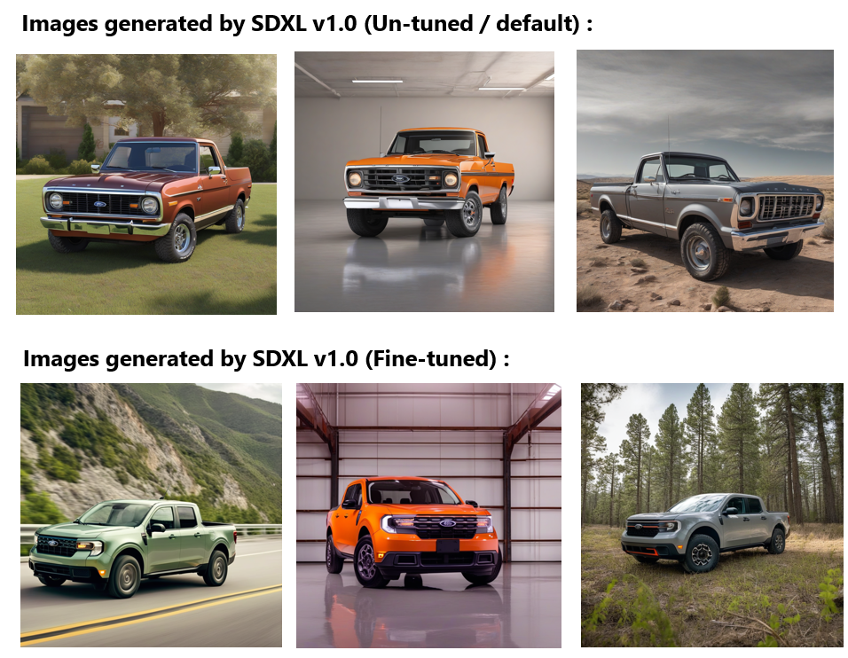

# **Finetune Stable Diffusion with DreamBooth**

Fine-tuning is crucial for personalizing a Stable Diffusion model to generate images of specific objects, styles, or characters that the base model doesn’t recognize accurately.  
Although the base model is trained on a vast dataset, it may struggle with highly specialized subjects—such as a unique product, personal artwork, or a fictional character. By fine-tuning, the model can learn new concepts, which helps reduce hallucinations and unwanted variations.  
Furthermore, fine-tuning offers greater control over style and details, ensuring that outputs align with artistic or branding needs—a benefit for marketing and creative content. Unlike full model training, DreamBooth fine-tuning only requires a small dataset (10–20 images), making it computationally efficient while still producing highly personalized and high-quality image generations.

---

## **1️⃣ Setup Environment**

### **Install Dependencies**
```bash
pip install huggingface-hub==0.20.2
pip install autotrain-advanced==0.6.61
```

---

## **2️⃣ Training Process**

### **Step 1: Prepare the Training Data**
- Collect a dataset of images for fine-tuning the model.
- Organize them in a directory (e.g., `MyCustomSubject` inside `/data/mycustomsubject/`).

### **Step 2: Run Training Script**
Execute the **training script** with the required arguments.  
*(Note: The trained model will be saved to a Hugging Face repository. Make sure to create the repo first and use its ID in your script.)*

```bash
python train_dreambooth.py \
    --data_dir "/path/to/data" \
    --repo_id "YourHFUsername/train_sdxl" \
    --hf_token "your_huggingface_token"
```

#### **✅ Optional Arguments:**
| Argument                      | Description                                              | Default                                               |
|------------------------------|----------------------------------------------------------|-------------------------------------------------------|
| `--project_name`             | Name of the training project                             | `Dreambooth_SDXL`                                     |
| `--model_name`               | Base model to fine-tune                                  | `stabilityai/stable-diffusion-xl-base-1.0`           |
| `--data_dir`                 | Path to dataset                                          | **(Required)**                                        |
| `--repo_id`                  | Hugging Face repo to push trained model                 | **(Required)**                                        |
| `--hf_token`                 | Hugging Face API token                                   | **(Required)**                                        |
| `--prompt`                   | Training prompt                                          | `"A photorealistic image of a <myObject001>, ultra-detailed, natural lighting, 8k resolution."` |
| `--class_prompt`             | Generalized class prompt                                 | `"A photorealistic image of a generic subject, ultra-detailed, natural lighting, 8k resolution."` |
| `--resolution`               | Image resolution for training                            | `1024`                                                |
| `--batch_size`               | Batch size for training                                  | `1`                                                   |
| `--num_steps`                | Number of training steps                                 | `1000`                                                |
| `--gradient_accumulation`    | Gradient accumulation steps                              | `4`                                                   |
| `--learning_rate`            | Learning rate                                            | `5e-5`                                                |
| `--use_fp16`                 | Use FP16 training                                        | `False` (default)                                     |
| `--use_gradient_checkpointing` | Enable gradient checkpointing                          | `False` (default)                                     |
| `--push_to_hub`              | Push the trained model to Hugging Face Hub              | `False` (default)                                     |

#### **🔹 Example with FP16 & Push to Hub**
```bash
python train_dreambooth.py \
    --data_dir "/path/to/data" \
    --repo_id "YourHFUsername/train_sdxl" \
    --hf_token "your_huggingface_token" \
    --use_fp16 \
    --push_to_hub
```

### **Step 3: Monitor Training**
- The script will **fine-tune** the model and **save** it to the Hugging Face Hub if `--push_to_hub` is enabled.
- If training locally, the model will be saved to a directory on your machine.

---

## **3️⃣ Inference (Generating Images)**

After fine-tuning, you can generate new images using **Stable Diffusion XL** with LoRA fine-tuning.

### **Step 1: Run Inference Script**
```bash
python generate_images.py \
    --model_id "YourHFUsername/train_sdxl" \
    --prompt "A wide-angle shot of a <myObject001>, epic landscape, cinematic, clear sky." \
    --negative_prompt "distorted, grainy, artifacts, out of focus, low quality, blurry, cartoonish, unrealistic, low-resolution, motion blur, unwanted details" \
    --output "output_custom.png"
```

#### **✅ Inference Arguments**
| Argument          | Description                                        | Default                     |
|-------------------|----------------------------------------------------|-----------------------------|
| `--model_id`      | ID of the trained model (Hugging Face repo)        | **(Required)**              |
| `--prompt`        | Prompt to generate images                          | **(Required)**              |
| `--negative_prompt` | Negative prompt to filter out unwanted artifacts | distorted, grainy, artifacts, out of focus, low quality, blurry, cartoonish, unrealistic, low-resolution, motion blur, people, top view, bad wheels            |
| `--num_steps`     | Number of inference steps                          | `25`                        |
| `--guidance`      | Guidance scale                                     | `7.7`                       |
| `--num_images`    | Number of images to generate                       | `4`                         |
| `--rows`          | Rows in the output image grid                      | `2`                         |
| `--cols`          | Columns in the output image grid                   | `2`                         |
| `--output`        | Filename for the generated image                   | `output_custom_model.png`   |

#### **🔹 Example with Custom Steps & Output Filename**
```bash
python generate_images.py \
    --model_id "YourHFUsername/train_sdxl" \
    --prompt "A close-up shot of a <myObject001>, hyper-realistic details, cinematic lighting" \
    --num_steps 50 \
    --output "custom_inference.png"
```

### **Step 2: View Output**
- The script will generate a **grid of images** and save it as `output_custom.png` (or the filename you specify).
- Use any image viewer to open the resulting file.

---

## **Example**
I trained **SDXL v1.0** to produce more realistic images of a Ford Maverick Pickup truck. Below is a comparison of the default model versus the fine-tuned model :

**Example Prompt :** A centered front-angle photograph of a < myMav011 > Ford Maverick pickup truck, captured in bright daylight with crisp focus, 8k resolution, photorealistic, and ultra-detailed.

